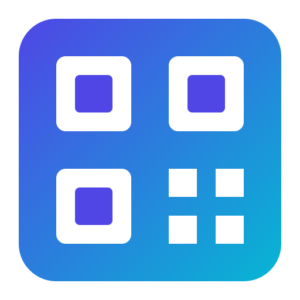

<div align="center">

  

  # QR Master Studio

  **Next-Generation QR Code Generator & Scanner Web Application**

  [](LICENSE)
  [](https://developer.mozilla.org/en-US/docs/Web/HTML)
  [](https://developer.mozilla.org/en-US/docs/Web/CSS)
  [](https://developer.mozilla.org/en-US/docs/Web/JavaScript)
  [](https://github.com/SAHALMCPVR/QR-Code-Generator)

  <p align="center">
    A state-of-the-art, feature-packed QR Code Studio with a dual-pane layout, real-time live preview, gradient customization, custom dot & corner shapes, logo overlay, camera/file scanner, bulk generator, and persistent local history.
  </p>

</div>

---

## ✨ Features Showcase

### ⚡ 1. Multi-Content Generators
Create specialized QR codes tailored for various use cases:
- **🌐 Website URL**: Instant web links with auto protocol detection and 1-click preset chips (*Google, YouTube, GitHub, Wikipedia*).
- **📝 Plain Text**: Custom notes, strings, or raw data.
- **📶 Wi-Fi Credentials**: Format scannable Wi-Fi network payloads (`WIFI:S:ssid;T:WPA;P:password;;`).
- **📇 vCard Contact Cards**: Full contact details for seamless single-scan address book saving.
- **✉️ Email**: Pre-filled `mailto:` links with subject and body.
- **💬 SMS / Phone**: Direct SMS payload generator.

### 🎨 2. Pure Modern Glass Customization Engine
Customize every aspect of your QR code visually:
- **Color Modes**: Solid Colors, **Linear Gradients**, and **Radial Gradients**.
- **QR Dot Shapes**: Square (Standard), **Rounded Dots**, **Circles**, and **Classy Smooth**.
- **Corner Finder Frame Shapes**: Square, **Rounded Frame**, and **Circle Frame**.
- **Center Logo Overlay**: Upload any PNG/JPG/SVG logo with dynamic scaling and rounded backdrop masking.
- **Error Correction**: Low (7%), Medium (15%), Quartile (25%), and High (30% - optimal for logo overlay).
- **HD Resolution**: Export from standard 256px up to 1024x1024 Ultra HD.

### 📷 3. Camera & Image File Scanner
- **Live Webcam Scan**: Scan physical QR codes directly using your desktop webcam or smartphone camera.
- **Drag & Drop Image Scanner**: Drop any image file (PNG, JPG, WEBP, SVG) to decode QR contents instantly.
- **Smart Result Actions**: One-click text copy and smart URL opener.

### 📦 4. Bulk QR Code Generator
- Generate multiple QR codes simultaneously from a multi-line list.
- Batch download all generated QR images with one click.

### 💾 5. History & Favorites Log
- Persistent `localStorage` history collection.
- Real-time search and filter.
- 1-click reload into generator, copy text, or delete item.

### 🚀 6. Multi-Format Export
- **PNG Download**: Crisp high-resolution PNG export.
- **SVG Vector Export**: Scalable Vector Graphics `.svg` export for print design and vector editing.
- **Clipboard Copy**: Direct image copying to system clipboard.

---

## 🛠️ Technology Stack

| Component | Technology |
| :--- | :--- |
| **Structure** | HTML5 Semantic Web Architecture |
| **Styling** | Vanilla CSS3 (Glassmorphism, Ambient Mesh Glows, Custom Properties) |
| **Logic Engine** | Vanilla ES6+ JavaScript |
| **QR Render Kernel** | Custom Canvas & Matrix Processor |
| **Icons & Typography** | FontAwesome 6, Google Fonts (*Plus Jakarta Sans*, *Outfit*, *Space Grotesk*) |

---

## 🚀 Quick Start Guide

### 1. Clone the Repository
```bash
git clone https://github.com/SAHALMCPVR/QR-Code-Generator.git
cd QR-Code-Generator
```

### 2. Run Locally
Because **QR Master Studio** is built with zero build steps or heavy node frameworks, you can run it directly:

#### Option A: Python HTTP Server (Recommended)
```bash
python -m http.server 8000
```
Open **`http://localhost:8000`** in your web browser.

#### Option B: Double Click
Simply open `index.html` directly in any modern web browser!

---

## 📁 Directory Structure

```
QR-Code-Generator/
├── index.html        # Main HTML5 Studio interface & markup
├── style.css         # Pure Modern Glass CSS design system & animations
├── script.js        # Canvas rendering engine, customizer logic & scanner
├── logo.svg          # Official QR Master Studio SVG branding logo
├── README.md         # Documentation & project overview
└── lib/
    ├── qrcode.min.js       # Base QR Matrix Generator
    └── html5-qrcode.min.js # Webcam & File QR Decoder Library
```

---

## 📄 License

Distributed under the **MIT License**. See `LICENSE` for more information.

<div align="center">
  <sub>Built with ❤️ by <a href="https://github.com/SAHALMCPVR">SAHALMCPVR</a></sub>
</div>
